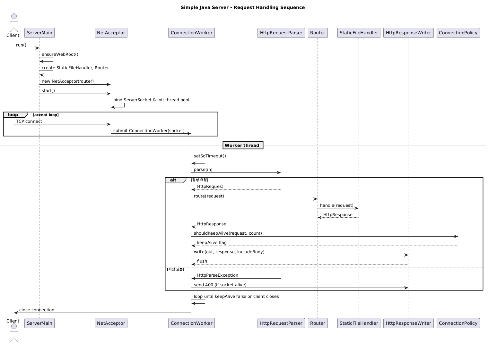

# Simple Java Server

자바 표준 라이브러리(`java.net`, `java.util.concurrent`)만 사용하여 구현한 간단한 HTTP/1.1 서버입니다. 정적 파일을 서빙하고, 다중 연결을 위해 스레드 풀을 사용합니다.

## 빌드

1. JDK 17 이상을 설치하고 `java -version`으로 확인합니다.
2. Maven을 설치한 뒤 `mvn -v`로 동작 여부를 확인합니다.
3. 프로젝트 루트(이 README가 위치한 곳)에서 아래 명령을 실행합니다.
   ```bash
   mvn package
   ```
4. 성공하면 `target/simple-java-server-0.1.0.jar` 실행 파일이 생성됩니다.

## 실행

루트 디렉터리에서 다음 명령을 실행하면 `www/` 디렉터리의 파일을 8080 포트로 제공합니다.
```bash
java -jar target/simple-java-server-0.1.0.jar
```

서버는 최초 실행 시 `www/index.html`이 없으면 기본 페이지를 생성합니다. 커스텀 정적 파일을 덮어쓰려면 `www/` 폴더에 원하는 파일을 배치하면 됩니다.

## 아키텍처 개요

* `server.ServerMain` – 진입점. 정적 핸들러/라우터/NetAcceptor를 초기화하고 서버를 구동합니다.
* `server.core.NetAcceptor` – `ServerSocket`을 열고 연결을 받으면 `ConnectionWorker`에 위임합니다.
* `server.core.ConnectionWorker` – 각 연결에 대한 요청 파싱, 라우팅, 응답 작성을 담당합니다.
* `server.http.*` – HTTP 요청/응답 객체, 파서, 응답 작성기, keep-alive 정책 등이 포함됩니다.
* `server.route.*` – 기본 라우터, 정적 파일 핸들러, 애플리케이션 라우트 레지스트리.
* `server.util.*` – 콘솔 로거와 MIME 타입 헬퍼.

## 애플리케이션 라우트 확장

동적인 웹 어플리케이션 기능은 `server.app` 패키지에 구성합니다.

* `server.app.AppRoutes` – 애플리케이션 전용 라우트를 등록하는 곳입니다. 필요 시 새로운 URL 경로와 핸들러를 여기에 추가하세요.
* `server.app.handlers.LoginGetHandler` – 로그인 폼을 렌더링하는 GET 핸들러 예시.
* `server.app.handlers.LoginPostHandler` – 로그인 제출을 처리하는 POST 핸들러 예시 (TODO 영역에 인증 로직을 구현).
* 라우트 등록은 `RouteRegistry`를 통해 이루어지며, `Router` 가 우선적으로 앱 라우트를 검사한 뒤 정적 파일을 서비스합니다.

## 다이어그램

PlantUML 소스는 `docs/` 디렉터리에 있습니다.

* `docs/class-diagram.puml` – 주요 클래스 관계를 나타내는 클래스 다이어그램
* `docs/sequence-diagram.puml` – 클라이언트 요청이 처리되는 순서를 나타내는 시퀀스 다이어그램
* 렌더링한 이미지는 README 전용으로 `docs/images/` 폴더에 관리합니다.




PlantUML CLI나 VSCode 플러그인, 또는 [PlantUML 온라인 서버](https://www.plantuml.com/plantuml/)에서 렌더링할 수 있습니다.

## POST 테스트

간단한 POST 요청은 다음과 같이 확인할 수 있습니다.

```bash
# 애플리케이션 라우트 (샘플 로그인)
curl -i -X POST http://localhost:8080/login -d "username=test&password=secret"

# 기본 POST 핸들러(등록되지 않은 경로)
curl -i -X POST http://localhost:8080/submit -d "name=sejong&message=hello"
```

`/login`은 샘플 로그인 핸들러가 처리하며, `/submit`은 기본 POST 핸들러가 요청 내용을 그대로 에코합니다.

## 개발 메모

* HTTP/1.0/1.1 기본 규칙만 지원하며, chunked 전송과 압축은 구현하지 않았습니다.
* `Connection: keep-alive` 정책을 적용하여 연결당 최대 100개의 요청을 처리합니다.
* 정적 파일 접근 시 디렉터리 탈출(`..`)을 방지합니다.
